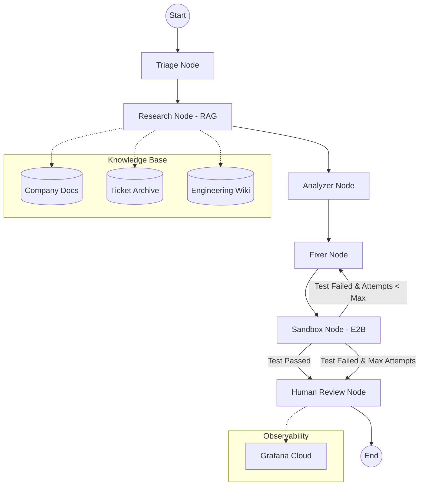

# 🚀 Self-Healing AI Customer Support Agent

## Intelligent, Autonomous, and Resilient Customer Issue Resolution

This project introduces a cutting-edge **Self-Healing AI Customer Support Agent** designed to autonomously diagnose, resolve, and learn from technical support tickets. Leveraging advanced AI orchestration with LangGraph, Retrieval-Augmented Generation (RAG), and a secure code execution sandbox (E2B), this agent dramatically reduces resolution times, improves customer satisfaction, and frees up human support teams to focus on complex, high-value interactions. Its self-correcting mechanisms ensure continuous improvement and robust performance in dynamic environments.

## ✨ Key Features

*   **Autonomous Ticket Triage & Classification**: Automatically categorizes incoming support tickets by issue type, severity, and technical domain (e.g., authentication, API, database, general).
*   **Retrieval-Augmented Generation (RAG)**: Intelligently searches and synthesizes information from comprehensive knowledge bases, including company technical handbooks, archived support tickets, and engineering wikis, to formulate precise solutions.
*   **Self-Healing Loop with Code Execution Sandbox**: Features a sophisticated feedback loop where proposed code fixes or configuration changes are tested in a secure E2B sandbox. If tests fail, the agent iteratively refines its solution, ensuring robustness and minimizing human intervention.
*   **Root Cause Analysis & Error Diagnosis**: Utilizes large language models (LLMs) to perform deep analysis, identifying the underlying root cause of issues and providing detailed technical diagnoses.
*   **Proactive Monitoring & Observability**: Integrates with Grafana Cloud for real-time monitoring of agent performance, ticket resolution metrics, and system health, providing critical insights for operational excellence.
*   **Kubernetes-Ready Deployment**: Designed for cloud-native environments, with Docker and Kubernetes configurations for scalable and resilient deployment.
*   **Human-in-the-Loop Verification**: Incorporates a human review stage for critical or unverified solutions, ensuring quality control and continuous learning.

## 🧠 Architecture Overview

The agent's intelligence is orchestrated through a LangGraph-powered state machine, enabling a dynamic and adaptive workflow for ticket resolution. The core components interact as follows:



### Workflow Explanation:

1.  **Start**: An incoming customer support message initiates the process.
2.  **Triage Node**: Classifies the ticket based on issue type, severity, and category using an LLM.
3.  **Research Node (RAG)**: Queries a ChromaDB vector store, enriched with company documentation, past tickets, and engineering wikis, to retrieve relevant information.
4.  **Analyzer Node**: Synthesizes information from the triage and research phases to determine the root cause, error diagnosis, and expected solution type.
5.  **Fixer Node**: Generates a proposed solution (code fix, config change, or system bug resolution) based on the analysis.
6.  **Sandbox Node (E2B)**: Executes and tests the proposed solution in an isolated environment. This is the 
crucial "self-healing" component, allowing for iterative refinement.
7.  **Conditional Routing**: If the sandbox test passes, the solution proceeds to human review. If it fails and retry attempts are available, it loops back to the Fixer Node. If it fails after maximum attempts, it also proceeds to human review.
8.  **Human Review Node**: A human operator verifies the solution, especially for complex or unresolvable issues, and the agent learns from this feedback. Metrics are sent to Grafana Cloud for observability.
9.  **End**: The ticket resolution process concludes.

## 🛠️ Tech Stack

| Category           | Technology           | Description                                                                  |
| :----------------- | :------------------- | :--------------------------------------------------------------------------- |
| **AI Orchestration** | LangGraph            | State machine for dynamic agent workflow and self-healing loops.             |
| **Vector Database**  | ChromaDB             | Stores and retrieves document embeddings for RAG.                            |
| **Database**         | Supabase (PostgreSQL)| Persistent storage for tickets and agent state.                              |
| **Code Sandbox**     | E2B                  | Secure, isolated environment for testing proposed code fixes.                |
| **Monitoring**       | Grafana Cloud        | Real-time observability and performance metrics.                             |
| **Deployment**       | Railway, Docker, K8s | Cloud-native deployment and containerization.                                |
| **LLM Provider**     | Groq                 | Powers the Triage, Analyzer, and Fixer nodes for intelligent processing.     |
| **Embeddings**       | Sentence Transformers| Generates vector embeddings for efficient semantic search in RAG.            |
| **Web Framework**    | FastAPI              | Provides a high-performance API for interacting with the agent.              |

## 🚀 Getting Started

To set up and run the Self-Healing AI Customer Support Agent locally, follow these steps:

### Prerequisites

*   Python 3.9+
*   Docker (for containerized deployment)
*   Kubernetes (for orchestrating deployments)

### Installation

1.  **Clone the repository:**

    ```bash
    git clone https://github.com/MuhammadAbbas01/Self_Healing_Customer_support_agent.git
    cd Self_Healing_Customer_support_agent
    ```

2.  **Install dependencies:**

    ```bash
    pip install -r requirements.txt
    ```

3.  **Environment Variables:**

    Create a `.env` file in the root directory and configure the following:

    ```env
    GROQ_API_KEY="your_groq_api_key"
    DATABASE_URL="your_supabase_postgresql_connection_string"
    E2B_API_KEY="your_e2b_api_key"
    GRAFANA_URL="your_grafana_loki_endpoint"
    GRAFANA_USER="your_grafana_username"
    GRAFANA_TOKEN="your_grafana_api_token"
    ```

    *   **GROQ_API_KEY**: Obtain from [Groq Console](https://console.groq.com/).
    *   **DATABASE_URL**: Your PostgreSQL connection string, e.g., from [Supabase](https://supabase.com/).
    *   **E2B_API_KEY**: Obtain from [E2B Console](https://e2b.dev/).
    *   **GRAFANA_URL, GRAFANA_USER, GRAFANA_TOKEN**: Configure Grafana Cloud for monitoring.

### Running Locally

1.  **Setup RAG (Vector Database):**

    The `data.py` script will load your documentation, chunk it, and create a ChromaDB vector store. This happens automatically when `main.py` is run.

2.  **Start the FastAPI application:**

    ```bash
    python main.py
    ```

    The API will be accessible at `http://0.0.0.0:8000`.

### API Endpoints

*   **GET /**: Health check and available endpoints.
*   **POST /ticket**: Submit a new support ticket.

    Example Request:

    ```json
    {
      "message": "My API key is not working after the recent update.",
      "code": "const apiKey = 'sk-old-key';"
    }
    ```

## ☁️ Deployment

### Docker

Build the Docker image:

```bash
docker build -t self-healing-ai-agent .
```

Run the Docker container:

```bash
docker run -p 8000:8000 self-healing-ai-agent
```

### Kubernetes

Apply the Kubernetes deployment, service, and HPA configurations:

```bash
kubectl apply -f deploy/
```

## 🤝 Contributing

We welcome contributions to enhance the Self-Healing AI Customer Support Agent! Please refer to our `CONTRIBUTING.md` (coming soon) for guidelines on how to submit pull requests, report bugs, and suggest new features.

## 📄 License

This project is licensed under the MIT License - see the `LICENSE` file for details.

## 📞 Support

For any questions or issues, please open an issue on this GitHub repository.
